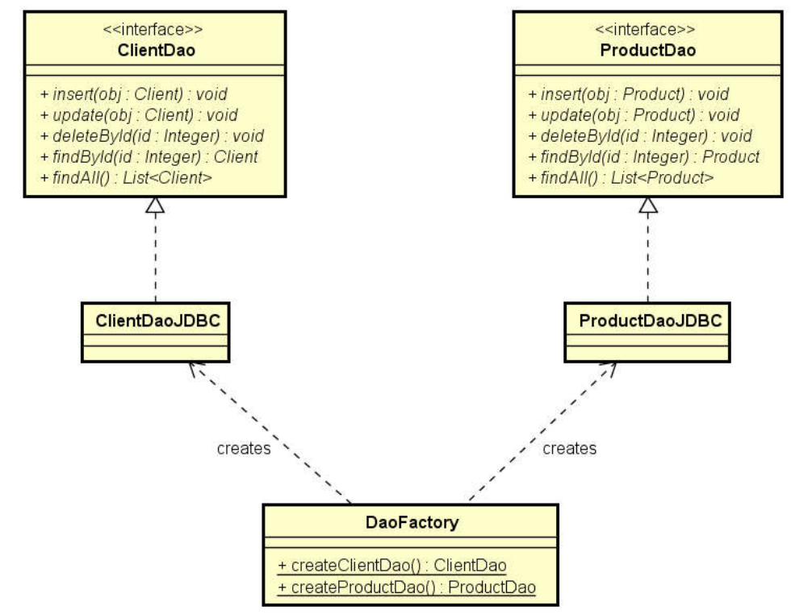
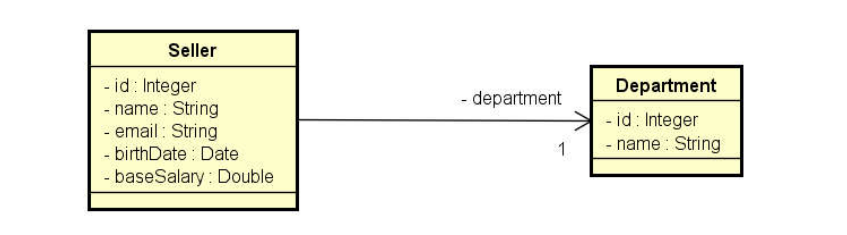
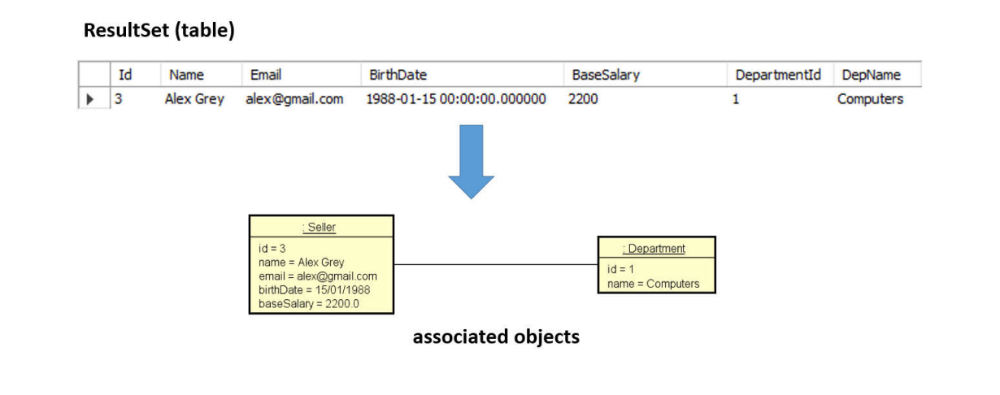
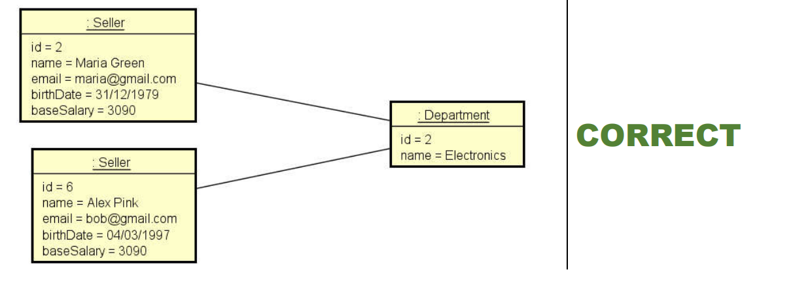

# Padrao Projeto DAO - Curso Nelio Alves

## DAO Pattern: Persistência de Dados utilizando o padrão DAO

- Padrão DAO (Data Access Object)

- https://www.devmedia.com.br/dao-pattern-persistencia-de-dados-utilizando-o-padrao-dao/30999

O padrão de projeto DAO surgiu com a necessidade de separarmos a lógica de negócios da lógica de persistência de dados.
Este padrão permite que possamos mudar a forma de persistência sem que isso influencie em nada na lógica de negócio, 
além de tornar nossas classes mais legíveis.

Classes DAO são responsáveis por trocar informações com o SGBD e fornecer operações CRUD e de pesquisas, elas devem ser 
capazes de buscar dados no banco e transformar esses em objetos ou lista de objetos, fazendo uso de listas genéricas, 
também deverão receber os objetos, converter em instruções SQL e mandar para o banco de dados.

Toda interação com a base de dados se dará através destas classes, nunca das classes de negócio, muito menos de formulários.

Se aplicarmos este padrão corretamente ele vai abstrair completamente o modo de busca e gravação dos dados, tornando 
isso transparente para aplicação e facilitando muito na hora de fazermos manutenção na aplicação ou migrarmos de banco de dados.

Também conseguimos centralizar a troca de dados com o SGBD (Sistema Gerenciador de Banco de Dados), teremos um ponto 
único de acesso a dados, tendo assim nossa aplicação um ótimo design orientado a objeto.

- ideia geral do padrão DAO:

 Para cada entidade, haverá um objeto responsável por fazer acesso a dados relacionado a esta entidade. 
Por exemplo:

        o Cliente: ClienteDao - >  ou seja o ClientDao será o objeto responsável por fazer o acesso a dados de clientes 
        o Produto: ProdutoDao ->  ou seja o ProdutoDao será o objeto responsável por fazer o acesso a dados de clientes 
        o Pedido: PedidoDao ->  ou seja o PedidoDao será o objeto responsável por fazer o acesso a dados de clientes 

 Cada DAO será definido por uma interface

 A injeção de dependência pode ser feita por meio do padrão de projeto Factory(Fabrica)

 Acesso a dados é acessar o BD, ou seja salvar, deletar, buscar, inserir ...

 o objeto Factory é responsável por instanciar as implementações do meu DAO

 Podemos fazer um DAO genérico também, nosso exemplo será um DAO para cada entidade

 JDBC(Java Database Connectivity). Java Database Connectivity é uma interface de programação de aplicativos para a 
linguagem de programação Java, que define como um cliente pode acessar um banco de dados. É uma tecnologia de acesso a 
dados baseada em Java usada para conectividade de banco de dados Java. Faz parte da plataforma Java Standard Edition, 
da Oracle

## PROJETO

- Implements Serializable é para os nossos objetos serem transformados em sequencias de bytes. Em java se quisermos que nosso
objeto seja gravado em arquivo, seja trafegado em rede temos que implementar o Serializable

## findById implementation

SQL Query:

        SELECT seller.*,department.Name as DepName
        FROM seller INNER JOIN department
        ON seller.DepartmentId = department.Id
        WHERE seller.Id = ?

um objeto ResultSet é uma tabela de dados que representa um conjunto de resultados de banco de dados, que
geralmente é gerado pela execução de uma instrução que consulta o banco de dados .
resultSet é um objeto com linhas e colunas como mostra a imagem, só que estamos programando OO
a nossa classe DAO é responsavel por pegar os dados do BD relacional e transformar oem objetos associados
como mostra abaixo

## Reusing instantiation

private Seller instantiateSeller(ResultSet rs, Department dep) throws SQLException {
        Seller obj = new Seller();
        obj.setId(rs.getInt("Id"));
        obj.setName(rs.getString("Name"));
        obj.setEmail(rs.getString("Email"));
        obj.setBaseSalary(rs.getDouble("BaseSalary"));
        obj.setBirthDate(rs.getDate("BirthDate"));
        obj.setDepartment(dep);
        return obj;
}

private Department instantiateDepartment(ResultSet rs) throws SQLException {
        Department dep = new Department();
        dep.setId(rs.getInt("DepartmentId"));
        dep.setName(rs.getString("DepName"));
        return dep;
}

## findByDepartment implementation

SQL Query:

SELECT seller.*,department.Name as DepName
FROM seller INNER JOIN department
ON seller.DepartmentId = department.Id
WHERE DepartmentId = ?
ORDER BY Name

## findAll implementation

SQL Query:

        SELECT seller.*,department.Name as DepName
        FROM seller INNER JOIN department
        ON seller.DepartmentId = department.Id
        ORDER BY Name

## insert implementation

SQL Query:
INSERT INTO seller
(Name, Email, BirthDate, BaseSalary, DepartmentId)
VALUES
(?, ?, ?, ?, ?)